<div align="center">

# 🌐 Confluence

### From Community Problems to Deployable Solutions

A digital collaboration platform that connects **citizens, universities, students, government and industry** to solve real-world societal challenges.

<p>
  
  
  
  
</p>

**Discover → Triage → Validate → Adopt → Innovate → Evaluate → Fund → Deploy → Verify**

</div>

---

## 📖 Table of Contents

- [Overview](#-overview)
- [The Problem](#-the-problem)
- [How It Works](#-how-it-works)
- [Key Features](#-key-features)
- [Workflow in Detail](#-workflow-in-detail)
  - [1. Problem Discovery & AI Triage](#1-problem-discovery--ai-triage)
  - [2. Validation & University Adoption](#2-validation--university-adoption)
  - [3. Student Solution Development](#3-student-solution-development)
  - [4. Review, Ranking & Selection](#4-review-ranking--selection)
  - [5. Industry / CSR Support & Deployment](#5-industry--csr-support--deployment)
- [Challenge Lifecycle](#-challenge-lifecycle)
- [End-to-End Sequence](#-end-to-end-sequence)
- [Roles & Responsibilities](#-roles--responsibilities)
- [Security & IP Protection](#-security--ip-protection)
- [Business Rules](#-business-rules)
- [System Architecture](#-system-architecture)
- [Conceptual Data Model](#-conceptual-data-model)
- [Analytics & Monitoring](#-analytics--monitoring)
- [Glossary](#-glossary)
- [Getting Started](#-getting-started)
- [Contributing](#-contributing)
- [Problem Statement](#-problem-statement)

---

## 🎯 Overview

**Confluence** turns everyday civic observations into structured challenges, routes them to universities for adoption, lets students build and pitch solutions, and connects the best ones with industry and CSR partners for real-world pilots — closing the loop with community feedback and measurable impact.

| | |
|---|---|
| **For citizens** | Report a local problem with a photo, description and location. |
| **For universities** | Adopt validated challenges and channel student talent toward them. |
| **For students** | Build, prototype and pitch solutions with faculty mentorship — with your IP protected. |
| **For government** | Validate genuine civic needs and track outcomes. |
| **For industry / CSR** | Discover vetted solutions and fund, mentor and scale them. |

---

## 🚧 The Problem

Communities encounter real problems every day, yet the path from *"someone noticed an issue"* to *"a working solution is deployed"* is fragmented:

- Citizen-reported issues rarely reach the people who can solve them.
- Universities and students lack a structured pipeline of real-world, validated problems.
- Student innovations often stall at the prototype stage without funding or field access.
- Industry and CSR partners lack a trusted channel to find and back credible solutions.
- Outcomes are seldom measured, so lessons are not fed back into new challenges.

Confluence provides a single, governed platform that connects these stakeholders end to end.

---

## 🔄 How It Works

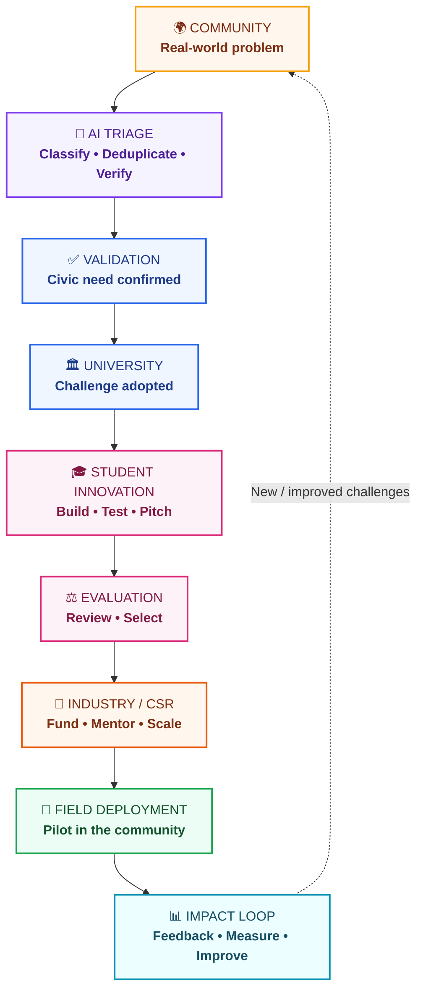

> **Central loop:** Problem → AI Triage → Validation → University Adoption → Student Innovation → Evaluation → Industry Support → Deployment → Community Feedback → Impact

---

## ✨ Key Features

| Feature | Description |
|---|---|
| 📸 **Grassroots reporting** | Citizens submit photo, description, location and supporting evidence from their phone. |
| 📦 **In-browser compression** | Images are compressed client-side (~5 MB → ~150 KB) for low-bandwidth use. |
| 🤖 **AI Smart Engine** | Automatic categorization, duplicate detection and GPS verification. |
| 🏛️ **Institutional validation** | District officers confirm genuine civic need before challenges go live. |
| 🔒 **University Adoption Gate** | Pitching stays locked until a university formally adopts the challenge. |
| 🧑‍🏫 **Faculty mentorship** | Mentors guide engineering, prototyping, lab testing and refinement. |
| 🔐 **IP Shield** | Two-layer submissions keep sensitive technical material confidential. |
| ⚖️ **Structured review** | A University Review Board evaluates technical merit, cost, impact and readiness. |
| 🏢 **Industry / CSR support** | Grants, hardware, mentorship and pilot-scale support for selected solutions. |
| 📊 **Impact analytics** | Dashboards track participation, progress, deployment and outcomes. |

---

## 🧭 Workflow in Detail

### 1. Problem Discovery & AI Triage

A citizen's observation becomes a structured challenge.

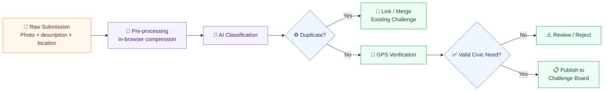

> **Design principle:** AI assists triage; the workflow still contains explicit validation and institutional review stages.

### 2. Validation & University Adoption

Challenges reach adoption through two discovery routes: **student nomination** (with a feasibility rationale) or **district officer validation**.

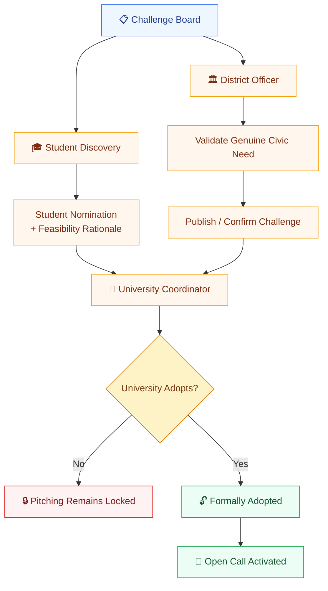

> ### 🔑 Critical business rule: *No adoption → No pitching*
> A student may discover and nominate a challenge, but solution pitching becomes available **only after formal university adoption**.

### 3. Student Solution Development

Once a challenge is adopted and the open call is active, student teams build and pitch solutions with faculty support.

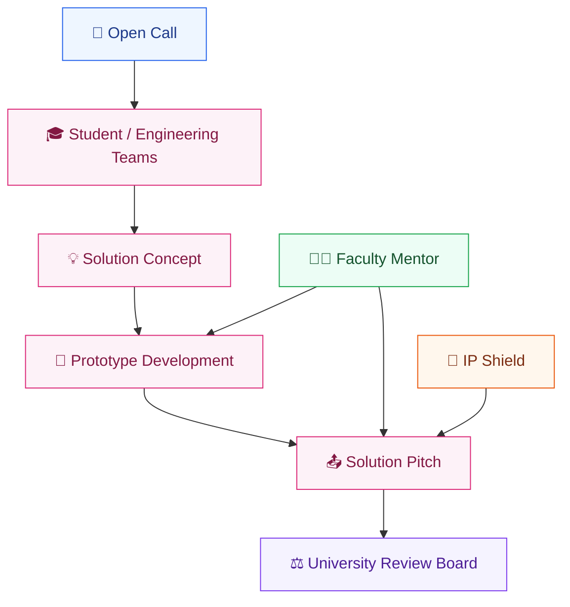

**Faculty mentors guide:** engineering decisions · prototype development · laboratory testing · technical refinement.

### 4. Review, Ranking & Selection

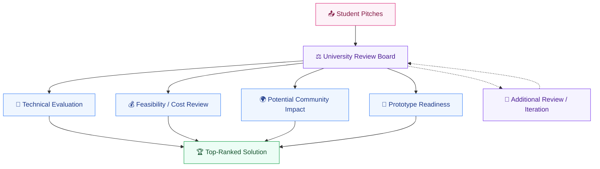

### 5. Industry / CSR Support & Deployment

Selected solutions can receive **grants**, **hardware**, **mentorship** and **pilot-scale support** before deployment in the community.

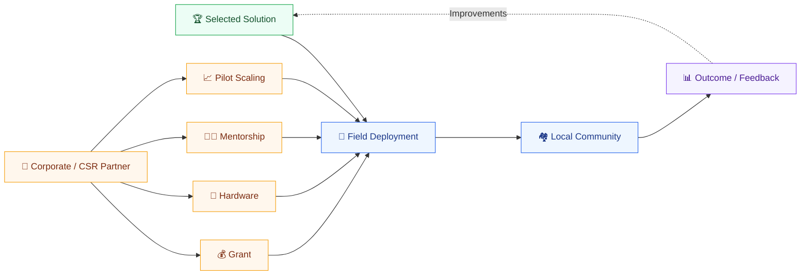

---

## 🔁 Challenge Lifecycle

Every challenge moves through a well-defined set of states.

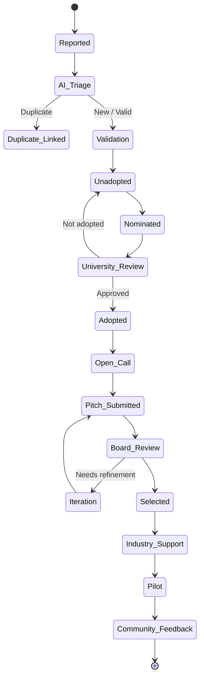

---

## 🧵 End-to-End Sequence

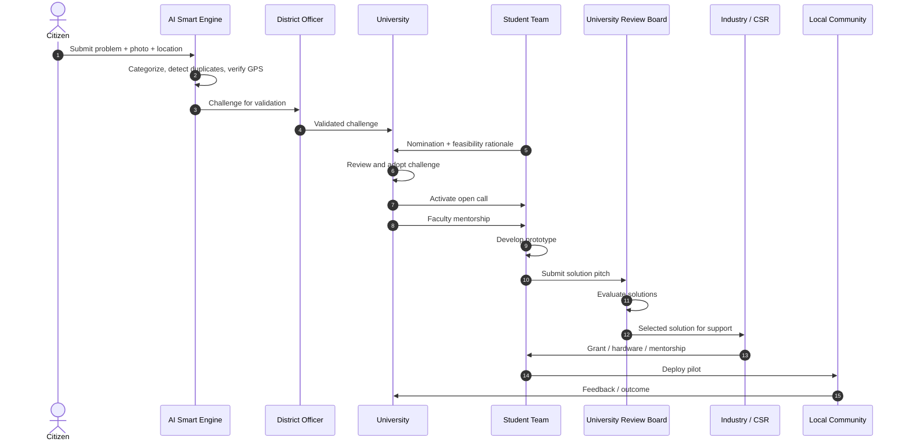

---

## 👥 Roles & Responsibilities

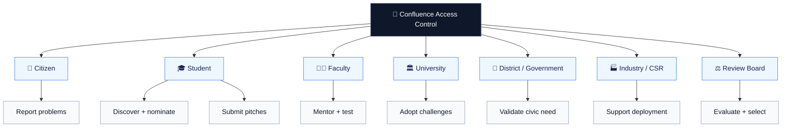

### Stakeholder responsibility matrix

| Stakeholder | Discover | Validate | Adopt | Build | Evaluate | Fund | Deploy | Feedback |
|---|:---:|:---:|:---:|:---:|:---:|:---:|:---:|:---:|
| Citizen / Community | ✓ | | | | | | | ✓ |
| Student | ✓ | | | ✓ | | | ✓ | |
| District Officer | | ✓ | | | | | | |
| University Coordinator | | | ✓ | | | | | |
| Faculty Mentor | | | | ✓ | ✓ | | | |
| Review Board | | | ✓ | | ✓ | | | |
| Industry / CSR | | | | | | ✓ | ✓ | |
| Government / Admin | | ✓ | ✓ | | ✓ | | ✓ | ✓ |

---

## 🔐 Security & IP Protection

Every student submission is split into a **public showcase layer** and a **confidential technical dossier**. Access to the confidential layer is enforced through **role-based access control (RBAC)**.

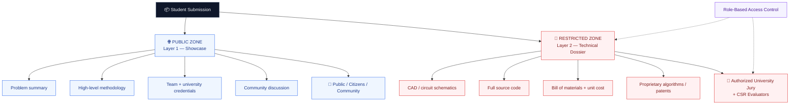

| Layer | Visibility | Contents |
|---|---|---|
| 🌐 **Layer 1 — Public Showcase** | Everyone | Problem summary, high-level methodology, team members, university credentials, community discussion |
| 🔐 **Layer 2 — Confidential Dossier** | Authorized evaluators only | CAD blueprints, circuit schematics, source-code repositories, bill of materials, unit-cost calculations, proprietary algorithms, patent-related information |

---

## 📜 Business Rules

| # | Rule | Purpose |
|---|---|---|
| 01 | **No adoption → No pitching** | Prevents uncontrolled solution submissions |
| 02 | Student nominations require a **feasibility rationale** | Adds an initial quality filter |
| 03 | AI performs **categorization and duplicate detection** | Structures incoming challenges |
| 04 | District validation can confirm a **genuine civic need** | Adds institutional validation |
| 05 | Student submissions have **public + confidential layers** | Separates visibility from sensitive technical material |
| 06 | Confidential material is restricted to **authorized evaluators** | Protects sensitive solution details |
| 07 | University review precedes selection | Provides institutional evaluation |
| 08 | Industry/CSR can provide **grants, hardware, pilot support and mentorship** | Enables deployment |
| 09 | Deployment produces community feedback | Creates an impact-verification loop |

---

## 🏗️ System Architecture

Recommended layered architecture:

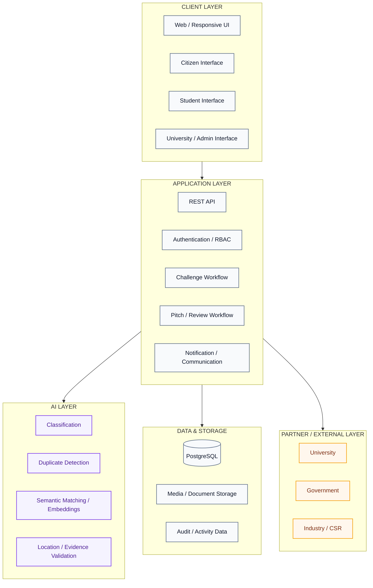

---

## 🗄️ Conceptual Data Model

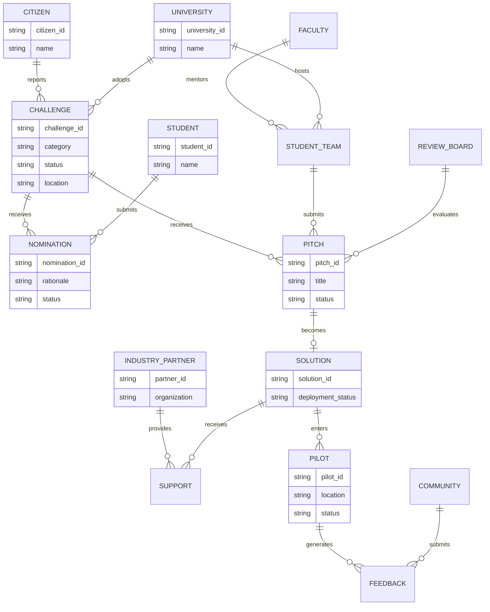

> ℹ️ This is a **conceptual data model** derived from the workflow, not the exact implemented database schema.

---

## 📊 Analytics & Monitoring

Operational events from every stage feed a shared analytics layer.

```mermaid
flowchart LR
    subgraph SRC["Data Sources"]
        B["Challenge data"]
        C["University data"]
        D["Student / pitch data"]
        E["Industry / CSR data"]
        F["Deployment data"]
        G["Community feedback"]
    end

    H["📊 Analytics Layer"]

    subgraph MET["Dashboards & Metrics"]
        I["Challenge volume"]
        J["Domain distribution"]
        K["Institutional participation"]
        L["Industry engagement"]
        M["Project progress"]
        N["Deployment / impact"]
    end

    SRC --> H --> MET

    classDef data fill:#eef6ff,stroke:#2563eb,color:#1e3a8a;
    classDef analytics fill:#f5f3ff,stroke:#7c3aed,color:#4c1d95;
    classDef metric fill:#ecfdf5,stroke:#16a34a,color:#14532d;

    class B,C,D,E,F,G data;
    class H analytics;
    class I,J,K,L,M,N metric;
```

---

## 📚 Glossary

| Term | Meaning |
|---|---|
| **Challenge** | A structured societal problem submitted to the platform |
| **AI Triage** | Automated categorization, duplicate detection and GPS verification |
| **Nomination** | Student proposal requesting consideration/adoption of a challenge |
| **Adoption** | University's formal acceptance of a challenge for solution development |
| **Open Call** | Stage where students can formally submit solutions |
| **IP Shield** | Separation/protection mechanism for sensitive technical material |
| **Pitch** | A student team's proposed solution |
| **Review Board** | University-level body that evaluates submitted solutions |
| **CSR Partner** | Corporate partner supporting funding, hardware, mentoring or pilot deployment |
| **Pilot** | Field deployment of a selected solution in a local community |

---

## 🚀 Getting Started

> 🛠️ **Note:** Replace the placeholders below with the project's actual setup details.

```bash
# 1. Clone the repository
git clone https://github.com/<your-org>/confluence.git
cd confluence

# 2. Install dependencies
# <install command>

# 3. Configure environment variables
cp .env.example .env

# 4. Run the development server
# <run command>
```

### Prerequisites

- `<runtime / language version>`
- PostgreSQL
- `<any other services, e.g. object storage>`

---

## 🤝 Contributing

Contributions are welcome!

1. Fork the repository
2. Create a feature branch: `git checkout -b feature/your-feature`
3. Commit your changes: `git commit -m "Add your feature"`
4. Push the branch: `git push origin feature/your-feature`
5. Open a Pull Request

**Reporting security issues:** please do not open a public issue for vulnerabilities — contact the maintainers privately instead.

---

## 🏁 Problem Statement

| | |
|---|---|
| **Hackathon** | Smart India Hackathon 2026 |
| **Problem Statement ID** | SIH26043 |
| **Category** | Software |
| **Theme** | Smart Education |

---

<div align="center">

**Problem → AI Triage → Validation → University Adoption → Student Innovation → Evaluation → Industry Support → Deployment → Community Feedback → Impact**

*Built to turn community problems into deployable solutions.* 🌍

</div>
